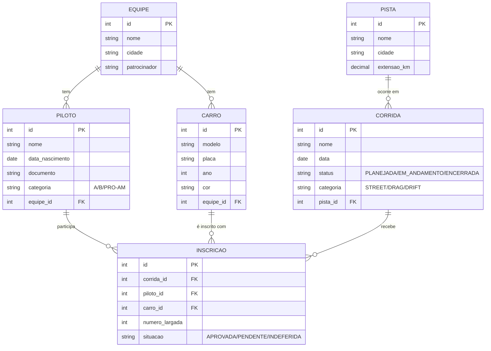

# 🏁 Sistema de Gestão de Corridas

Projeto desenvolvido em **Django** para gerenciar equipes, pilotos, carros, pistas e corridas, com interface administrativa integrada.

---

## 🚀 Como Executar o Projeto

### 1️⃣ Criar e ativar o ambiente virtual

Abra o terminal na pasta do projeto e execute:

#### Linux / Mac:
```bash
python -m venv venv
source venv/bin/activate
```

#### Windows:
```bash
python -m venv venv
venv\Scripts\activate
```

---

### 2️⃣ Instalar dependências
```bash
pip install django
```

---

### 3️⃣ Rodar migrações iniciais
```bash
python manage.py makemigrations
python manage.py migrate
```

---

### 5️⃣ Iniciar o servidor
```bash
python manage.py runserver
```

Depois abra no navegador:

👉 **http://127.0.0.1:8000/**

---

## 🧩 Diagrama Entidade-Relacionamento (ER)


